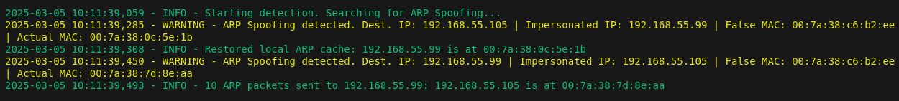

<div align="center">

    

</div>

# ARP Spoofing Detector and Response

This Python script is designed to detect and respond to ARP spoofing attacks within a local network. It utilizes the Scapy library to sniff ARP packets and compare the MAC addresses to identify potential spoofing attempts.

## Features

- Detects ARP spoofing attempts by monitoring ARP packets.
- Logs detailed information about detected spoofing attempts.
- Restores local ARP cache entries to revert spoofing effects.
- Mitigates the effects of ARP spoofing by sending packets to any machine under attack within your local network (Windows or Linux).
- Increases reliability by responding only with trusted MAC addresses, thereby avoiding amplification of spoofing attacks.
- Color-coded logging for better visibility in the console.
- Save logs information in a .log file.

## Requirements

- Python 3.x
- Scapy library.
- Execute the script on a Linux machine.
- Run the script with elevated privileges using `sudo` to sniff and send packets and modify local ARP cache.

You can install the required library using pip:

```bash
pip install scapy
```

## Args

The following arguments can be used when running the script:

- `-p`, `--packets`:
  - **Type**: `int`
  - **Description**: Number of ARP packets to send to mitigate the attack during each detection.
  - **Default value**: `10`
  - **Minimum value**: `1`
  - **Maximum value**: `1000`
  - **Usage**: Specify the number of packets to send. For example, `-p 20` will send 20 ARP packets.

## Usage

1. **Prepare Known Devices**: Create a `known_devices.json` file in the same directory as the script. This file can be:

   - **Empty or Nonexistent**: Use this option if you want to run the script only as a detector.
   - **Filled**: Include a list of known devices within your local network with their IP and MAC addresses. This allows the script to function as both a detector and a response tool to mitigate ARP spoofing attempts.

   Here is an example of how the `known_devices.json` file should look:

    ```json
    [
        {
            "ip_address": "192.168.55.1",
            "mac_address": "11:22:33:44:55:66"
        },
        {
            "ip_address":"192.168.55.2",
            "mac_address":"77:88:99:AA:BB:CC"
        }
    ]
    ```

2. **Run the Script**: Execute the script with Python. You will need to run it with elevated privileges to allow it to sniff and send packets and modify local ARP cache.

    ```bash    
    sudo python arp_spoofing_detector_and_response.py
    ```

    Or with `-p` option:

    ```bash    
    sudo python arp_spoofing_detector_and_response.py -p 20
    ```
    In this example, the script will send 20 ARP packets to mitigate the attack during each detection. If the `-p` option is not specified, the default value of 10 packets will be used.

3. **Monitor Output**: The script will start sniffing ARP packets and log any detected spoofing attempts. The logs will be saved in a file named with the current timestamp.

## Output example:
<div align="center">
    
</div>

## Logging

The script uses a custom logging configuration that outputs messages to both the console and a log file. The log messages are color-coded based on their severity level, but the script only displays at two levels, `WARNING` and `INFO`:

    DEBUG: Cyan
    INFO: Green
    WARNING: Yellow 
    ERROR: Red
    CRITICAL: Magenta
## Main Functions

    __init__(): Initializes the detector, sets up logging, and loads known devices.
    
    start_detection(): Begins sniffing ARP packets.
    
    process_packet(packet): Processes each ARP packet to detect spoofing.
    
    get_mac(ip): Retrieves the MAC address for a given IP.
    
    restore_local_arp_cache(host_ip, host_mac): Restores the local ARP cache for a specified IP.
    
    send_arp_packets(destination_ip, destination_mac, host_ip, host_mac): Sends ARP packets to restore MAC address references.
## License

This project is licensed under the MIT License. See the LICENSE file for details.
## Acknowledgments

    Scapy - For packet manipulation and sniffing capabilities.

Feel free to modify any sections to better fit your project or add any additional information that you think is necessary!
